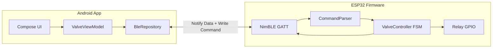
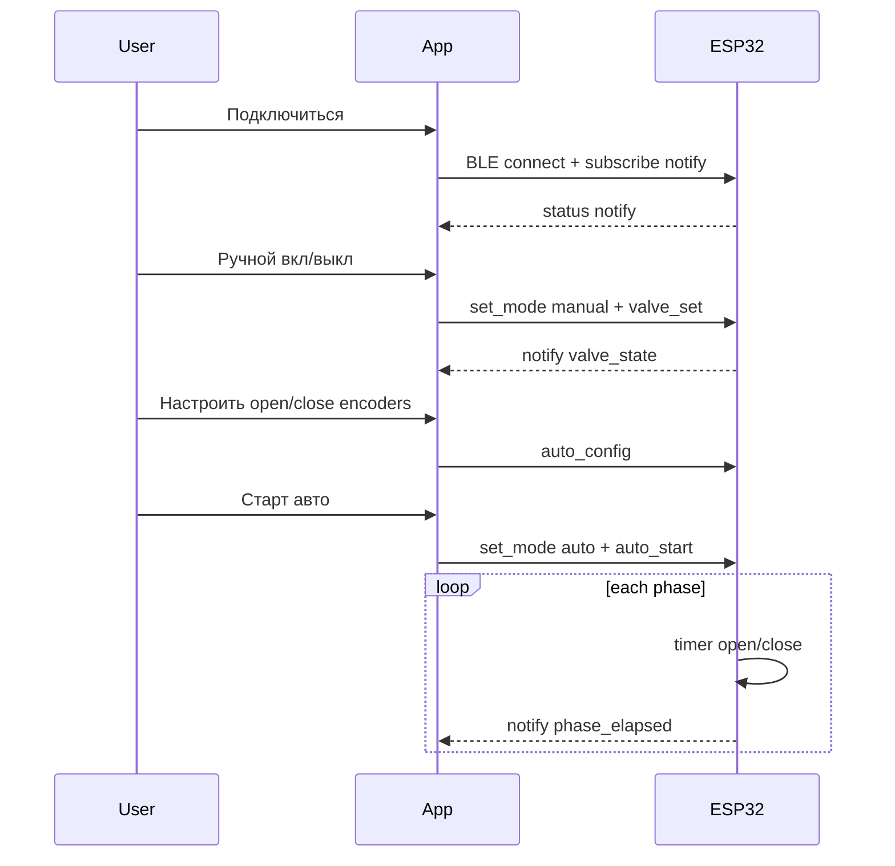

# План Android-приложения OxyPulseTrainer (управление клапаном)

## Контекст и границы MVP

Проект сейчас описан только в [`PROJECT_CONTEXT.md`](d:\Python_projects\AAA - OxyPulse\001 - OxyPulse\PROJECT_CONTEXT.md). Кода нет — создаём с нуля.

**В scope:**
- Минимальная прошивка ESP32: BLE GATT server, GPIO реле/клапана, FSM режимов, таймеры auto-режима
- Android-приложение: сканирование/подключение, экран управления клапаном, два «энкодера» в UI (Compose)
- Расширение BLE-протокола команд (JSON через Command Write)

**Вне scope MVP:**
- Датчики (O₂, CO₂, flow, pressure), Garmin/Wellue, Room/сессии, графики

**Ключевой принцип из контекста:** логика переключения клапана и таймеры — **на ESP32** (минимальная задержка, работа при кратком обрыве BLE). Приложение только задаёт режим и параметры.

---

## Архитектура



### Режимы работы (FSM на ESP32)

| Режим | Поведение |
|-------|-----------|
| `idle` | Клапан закрыт, таймеры остановлены |
| `manual` | Состояние клапана только по команде `valve_set` из приложения |
| `auto` | Цикл: OPEN → wait(open_ms) → CLOSE → wait(close_ms) → повтор |

Переходы:
- Нажатие **Ручной вкл/выкл** → `mode=manual` + toggle valve
- Нажатие **Старт авто** → `mode=auto` с текущими `open_ms`/`close_ms`
- Любая смена режима сбрасывает противоположный режим (manual ↔ auto взаимоисключающие)

---

## BLE-протокол (расширение существующего)

Используем UUID из [`PROJECT_CONTEXT.md`](d:\Python_projects\AAA - OxyPulse\001 - OxyPulse\PROJECT_CONTEXT.md):

- Service: `4fafc201-1fb5-459e-8fcc-c5c9c331914b`
- Data Notify: `beb5483e-36e1-4688-b7f5-ea07361b26a8`
- Command Write: `beb5483e-36e1-4688-b7f5-ea07361b26a9`

### Команды (JSON, UTF-8, ≤512 байт)

```json
{"cmd":"set_mode","mode":"idle|manual|auto"}
{"cmd":"valve_set","state":0}
{"cmd":"auto_config","open_ms":5000,"close_ms":2000}
{"cmd":"auto_start"}
{"cmd":"auto_stop"}
{"cmd":"ping"}
```

**Ответы/статус** — в Notify-пакете (упрощённый MVP без всех датчиков):

| Поле | Тип | Описание |
|------|-----|----------|
| seq | uint32 | счётчик |
| valve_state | uint8 | 0/1 |
| mode | uint8 | 0=idle, 1=manual, 2=auto |
| open_ms | uint32 | текущая длительность открытия |
| close_ms | uint32 | текущая длительность закрытия |
| phase_elapsed_ms | uint32 | прошло в текущей фазе |
| status_flags | uint8 | бит ошибок BLE/GPIO |
| crc8 | uint8 | CRC по полям |

Частота notify в MVP: **2–5 Гц** (достаточно для UI индикации фазы).

---

## Диапазон таймеров: 60 с → 1/60 с

- **Минимум:** `17 ms` (округление 1000/60)
- **Максимум:** `60000 ms`
- Шаг в UI: логарифмическая шкала (удобно для диапазона ~3600:1)

**UI «энкодеры» (Compose):**
- Два блока: «Открыт» и «Закрыт»
- Каждый: вертикальный `WheelPicker` / кастомный rotary control + отображение `X.XX с` или `XX ms` при < 1 с
- При изменении — debounce 300 ms → `auto_config` по BLE (даже до старта авто)
- Кнопка **Старт авто** отправляет `auto_config` + `set_mode:auto` + `auto_start`

---

## Прошивка ESP32 (минимальная)

**Стек:** Arduino + NimBLE (или ESP-IDF + NimBLE — выбрать один; для скорости MVP — **Arduino + NimBLE-Arduino**).

**Структура:**

```
firmware/oxypulse_mvp/
  platformio.ini          # или Arduino sketch
  src/
    main.cpp
    ble_server.{h,cpp}    # GATT, notify, parse JSON commands
    valve_controller.{h,cpp}  # FSM + esp_timer / FreeRTOS timer
    protocol.{h,cpp}      # CRC8, pack notify
    config.h              # UUID, GPIO pin relay
```

**Задачи FreeRTOS:**
1. `bleTask` — NimBLE loop, отправка notify
2. `valveTask` — FSM auto/manual, управление GPIO
3. (опционально) `watchdogTask` — при потере связи > N сек в manual — закрыть клапан (безопасность)

**GPIO:** один pin на релейный модуль 5V (активный HIGH/LOW — зафиксировать в `config.h` после проверки модуля).

**Логика auto-таймера:**
- `esp_timer` или `vTaskDelay` в dedicated task
- При смене `open_ms`/`close_ms` на лету — применять с **следующей фазы** (не обрывать текущую mid-phase без команды stop)

---

## Android-приложение

**Стек (из контекста):** Kotlin, Jetpack Compose, Hilt, MVVM, **blessed-android**.

**Структура модуля:**

```
android/
  app/
    src/main/
      java/.../oxypulse/
        OxyPulseApp.kt
        di/AppModule.kt
        ble/
          BleConstants.kt       # UUID
          BleRepository.kt      # scan, connect, write, subscribe notify
          DeviceParser.kt       # binary notify → ValveStatus
          CommandBuilder.kt     # JSON commands
        ui/
          MainActivity.kt
          connect/ConnectScreen.kt
          valve/ValveControlScreen.kt
          valve/ValveViewModel.kt
          components/
            DurationEncoder.kt  # log-scale wheel/slider
            ConnectionBanner.kt
            ValveToggleButton.kt
        domain/
          ValveMode.kt
          ValveStatus.kt
```

### Экраны MVP

**1. ConnectScreen**
- Скан BLE по service UUID
- Список устройств «OxyPulse-*»
- Индикатор: Disconnected / Connecting / Connected
- Автопереход на ValveControlScreen после connect

**2. ValveControlScreen** (основной)

```
┌─────────────────────────────┐
│ ● Connected  OxyPulse-XXXX  │
├─────────────────────────────┤
│ Режим: MANUAL / AUTO / IDLE │
│ Клапан: ОТКРЫТ / ЗАКРЫТ     │
│ Фаза: открыт 3.2 / 5.0 с    │  ← только в auto
├─────────────────────────────┤
│  [  РУЧНОЙ ВКЛ/ВЫКЛ  ]      │  ← toggle + set_mode manual
├─────────────────────────────┤
│  Открыт:  [encoder UI]      │
│  Закрыт:  [encoder UI]      │
│  [  СТАРТ АВТО  ] [ СТОП ]  │
└─────────────────────────────┘
```

**ViewModel:**
- `StateFlow<ConnectionState>`
- `StateFlow<ValveUiState>` — синхронизируется с notify
- Команды: `toggleManual()`, `startAuto()`, `stopAuto()`, `setOpenDuration()`, `setCloseDuration()`

**Разрешения Android 12+:** `BLUETOOTH_SCAN`, `BLUETOOTH_CONNECT`, `ACCESS_FINE_LOCATION` (legacy scan на API < 31).

---

## Потоки пользовательских сценариев



---

## Безопасность и UX

- При disconnect в **manual** с открытым клапаном — ESP32 auto-close через 5 с (настраиваемый failsafe)
- Кнопка **СТОП** → `auto_stop` + `set_mode idle` + закрыть клапан
- Disabled state кнопок при отсутствии BLE-соединения
- Все `Log.*` / `Timber` с `%t` форматом времени (правило проекта)
- Snackbar при ошибке записи характеристики / CRC mismatch

---

## Тестирование

| Уровень | Проверка |
|---------|----------|
| ESP32 unit | FSM переходы, границы 17–60000 ms, CRC |
| BLE | nRF Connect: write JSON, verify notify |
| Android | эмулятор не подходит — реальный телефон + ESP32 |
| E2E | manual toggle < 200 ms до щелчка реле; auto 5s/2s 10 циклов; смена manual прерывает auto |

---

## Порядок реализации

1. Зафиксировать JSON-команды и compact notify-формат в [`PROJECT_CONTEXT.md`](d:\Python_projects\AAA - OxyPulse\001 - OxyPulse\PROJECT_CONTEXT.md) (раздел BLE)
2. ESP32: blink relay + serial log → BLE GATT → FSM valve
3. Android: blessed scan/connect → парсинг notify → ValveControlScreen
4. Duration encoders + auto start/stop
5. Failsafe + polish UI states
6. E2E тест на железе

---

## Риски

- **Механика клапана 2V025-08:** интервалы < 100–200 ms могут не успевать физически — в UI показать предупреждение при < 200 ms
- **blessed-android vs Nordic:** blessed проще для MVP; при проблемах на конкретном OEM — fallback на Nordic UART library
- **Точность 17 ms на ESP32:** приемлема для реле; для sub-50 ms лучше busy-wait в high-priority task
